# EE107 Mid-Report

## Authors: Jacob Gerson, Asher Milberg, Mason Doshi

### Introduction

Our group wanted to use this image for our project.

#### Q1: Pulse with more bandwidth

Here are the time-domain plots
Half Sine Wave:

SSRC Wave: 

And the frequency domain dB plots:

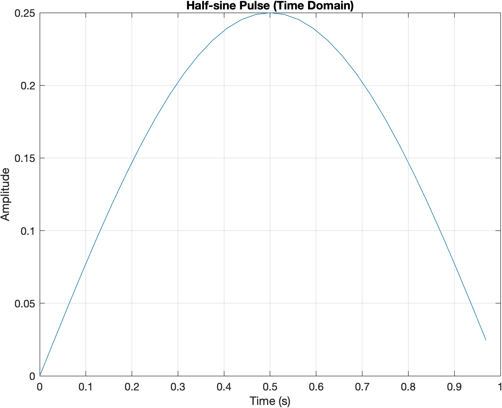

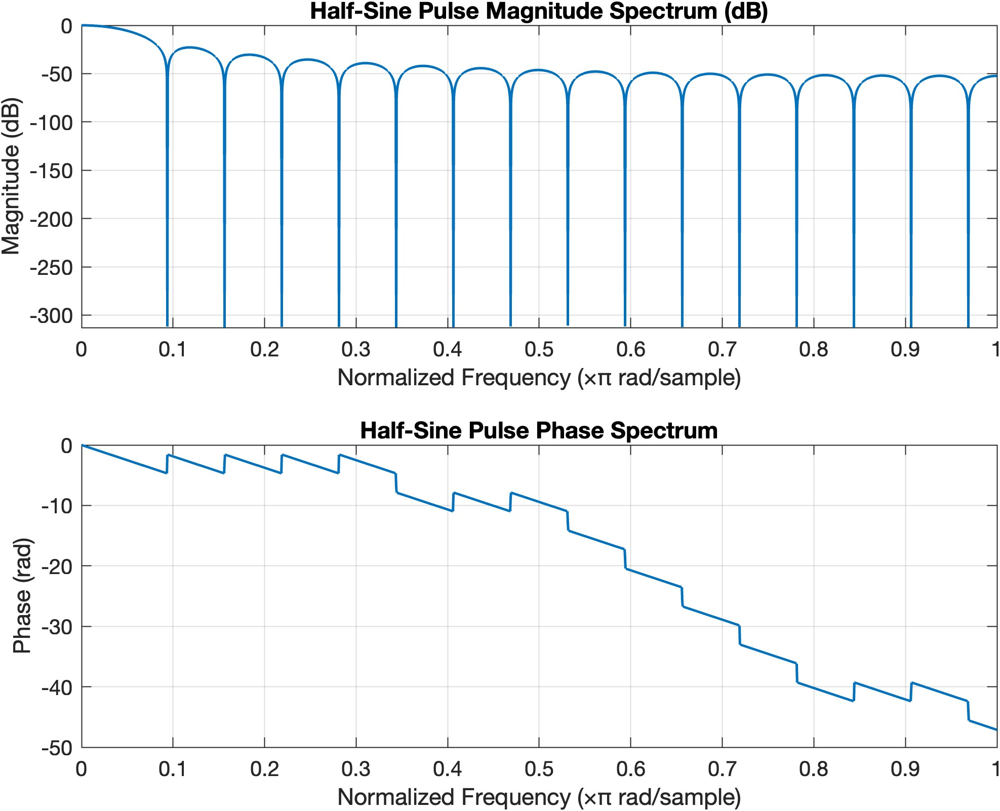

The half-sine frequency response uses more bandwidth that the SRRC pulse. The SRRC response has a flat response until ~ 0.5 Hz (which is shown by our rolloff factor alpha), and then drops off. 

In contrast, the half sine response decays very slowly - even at 5 Hz there is only ~ 30 dB drop off whereas at 5 Hz our SRRC response has dropped off by more than 100 dB.

A longer pulse in time means theres a shorter spectrum in the frequency domain and so this makes sense. Since the half-sine is much shorter in time (only one bit period) then its bandwidth is much greater while the SSRC has a much longer pulse in the time domain so its frequency bandwidth is much less.

As alpha decreases, the number of ripples around the peak increase and the bandwidth decreases and as alpha increases, the number of ripples decrease and the bandwidth increases since the transition band cutoff increases. This is because for increasing alphas, there is a larger cutoff so there is more bandwidth required.

Increasing K does not change the bandwidth of the SRRC pulse, since bandwidth is determined by α and T. However, a larger K reduces truncation error by preserving more of the pulse's decaying tails. This results in a frequency response that is closer to the ideal SRRC spectrum A small K much more greatly truncates the tails, causing energy leakage and ripples visible in the frequency domain.

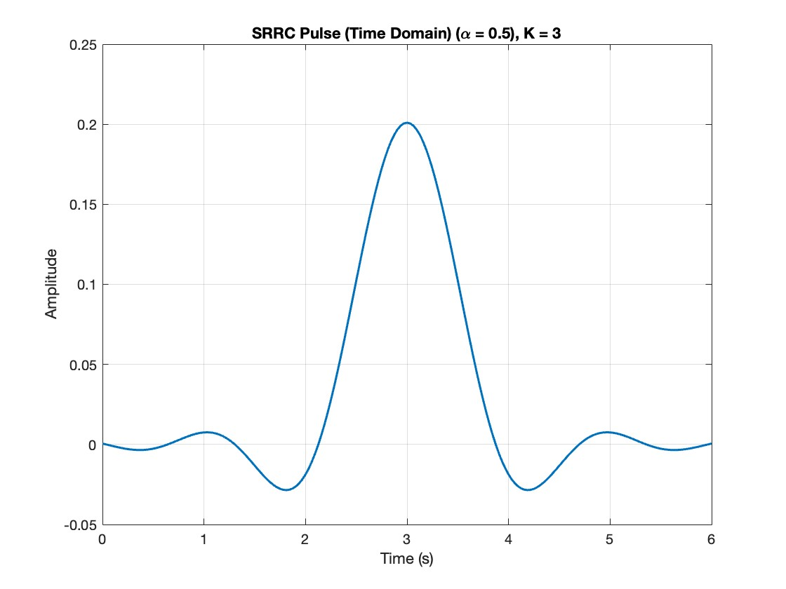

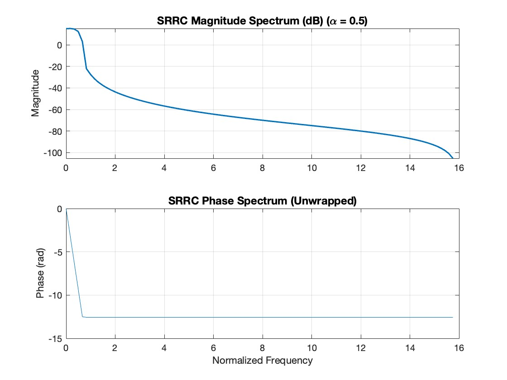

And here is the SRRC time and frequency domain plots with k = 6, alpha = 0.1:

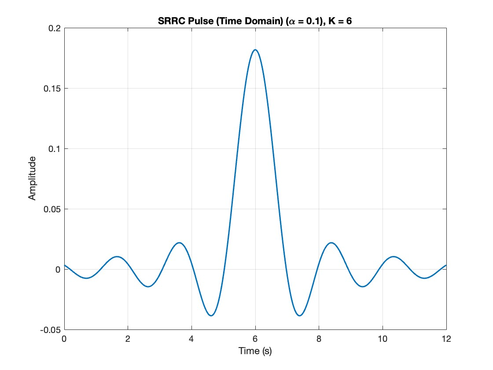

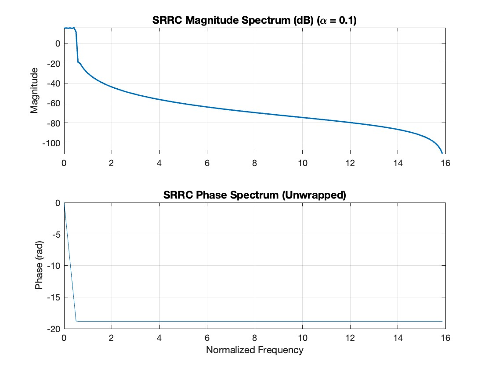

#### Q2: 10 Random Bits:

With a random 10 bit stream, below are the time domain modulations using both the half-sine pulse and SRRC pulse:

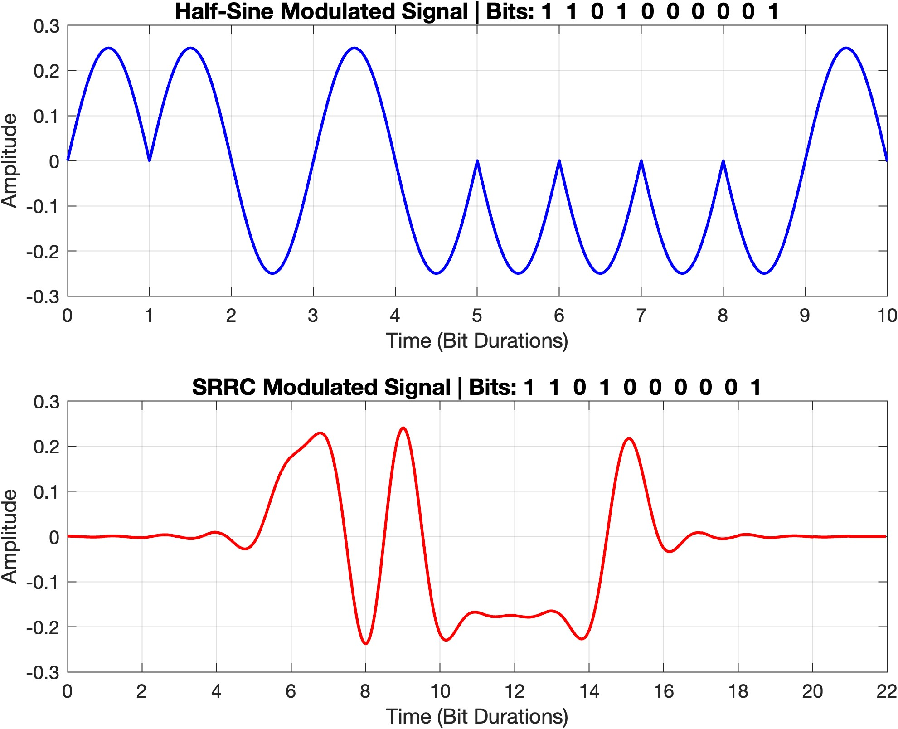

Half-Sine Observations: In the top plot, the half-sine modulated signal appears as distinct, non-overlapping half-periods of a sine wave. Because the half-sine pulse is strictly defined to exist only between $0 \le t \le 1$ bit duration, each pulse begins exactly where the previous one ends. This time-limited nature ensures that, at the transmitter, there is zero overlap between adjacent symbols.

SRRC Modulation Observation: In the bottom plot, the SRRC modulated signal looks very different. It looks like a continuous, fluctuating waveform that looks pretty analog. Because a single SRRC pulse spans 12 bit durations ($2K$), the pulses for the 10 consecutive bits overlap and interfere with each other. The amplitude at any given moment is the sum of the main lobe of the current bit and the decaying sidelobes of several surrounding bits.

#### Q3: Spectral Analysis of Modulated Signals

Plot the spectrum of the modulated signal (at the output of the pulse shaping filter) and compare with the pulse spectrum for each pulse. Do the modulated signal spectrum and pulse spectrum have similar shapes? Can you explain the reason for any difference?

Produced below are the spectra of both the modulated signals:

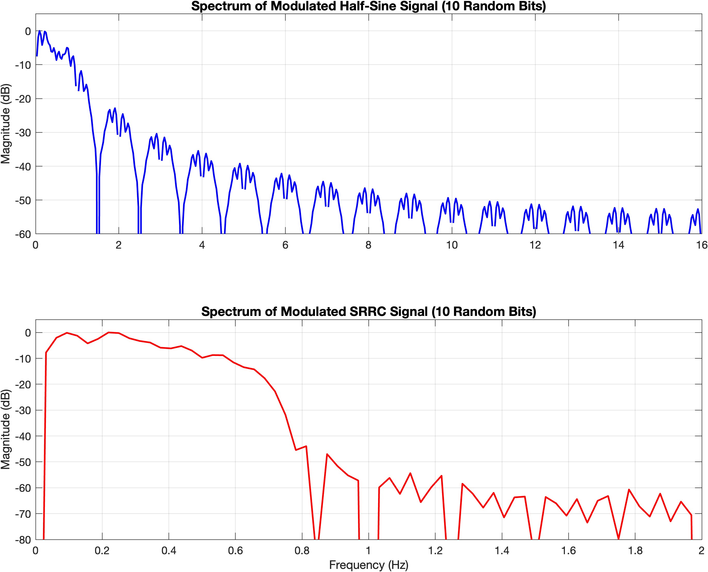

##### Overall Similarities

The modulated signal spectra (for both Half-Sine and SRRC) exhibit the same overall envelope as their corresponding isolated pulses from Question 1. This is because the spectral characteristics of a modulated signal are fundamentally determined by the pulse-shaping filter used. Mathematically, the modulated signal is a convolution of the pulse shape with a random bit sequence; in the frequency domain, this becomes a multiplication of the pulse's spectrum by the spectrum of the bit sequence.

##### Half-Sine Pulse Characteristics

The half-sine modulated spectrum is characterized by a prominent main lobe and a relatively gradual decay in the frequency domain. It features a rounded peak centered at $0$ Hz, which contains the vast majority of the signal's total energy. Because the half-sine pulse has sharp transitions in the time domain where the signal meets the zero-axis, its Fourier transform results in sidebands that decay at a relatively slow rate of $1/f^2$. This lack of a strict cutoff point results in significant high-frequency leakage, where the spectrum exhibits a continuous, slowly diminishing magnitude as frequency increases. This behavior makes the half-sine pulse less efficient for bandwidth-constrained systems, as it can lead to increased interference in adjacent frequency channels.

##### Square Root Raised Cosine (SRRC) Characteristics
The SRRC modulated spectrum is designed for high spectral efficiency and follows strict boundaries defined by its roll-off factor, $\alpha = 0.5$. Unlike the rounded peak of the half-sine, the SRRC exhibits a remarkably flat magnitude response near $0$ Hz, which ensures a more uniform distribution of power across the intended passband. The most defining feature of the SRRC is its extremely sharp cutoff; the magnitude transitions rapidly to a stopband of approximately $-80$ dB near the Nyquist frequency. This makes the SRRC spectrum significantly more "compact" and efficient than the half-sine. By $0.75$ Hz in a normalized system, the energy is almost entirely attenuated, making it an ideal choice for modern communication systems where frequency conservation is a priority.

##### Fluctuations
While the isolated pulses in the previous section produced perfectly smooth spectral curves, the modulated spectra appear jagged and erratic. This difference is caused by the random 10-bit data sequence. The specific arrangement of $+1$ and $-1$ bits creates a unique, high-variance frequency component. When this erratic component is multiplied by the smooth, theoretical frequency response of the pulse shape, it introduces constructive and destructive interference at specific frequencies across the band. Eye Diagrams

#### Q4 Modulated Signal Eye Diagrams:

Plots and Comments for the Eye Diagrams for both the Half-Sine and SRRC.

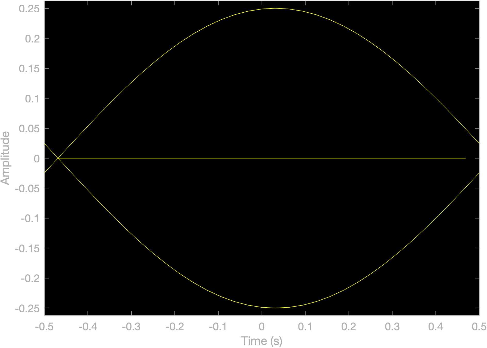

The transmit Half-Sine eye diagram is almost perfectly overlayed on top of each other. It is shifted slightly to the right, but this makes sense as we took one slice of data off the end so the plots were lined up with each other. This eye is wide, which follows the characteristics of the half-sine modulation. In the half-sine the signal period for each bit is entirely seperated and there is no overflow onto the following period from the current bit being transmitted. Since there is little overflow this creates a wide open, and thin signaled, eye. 

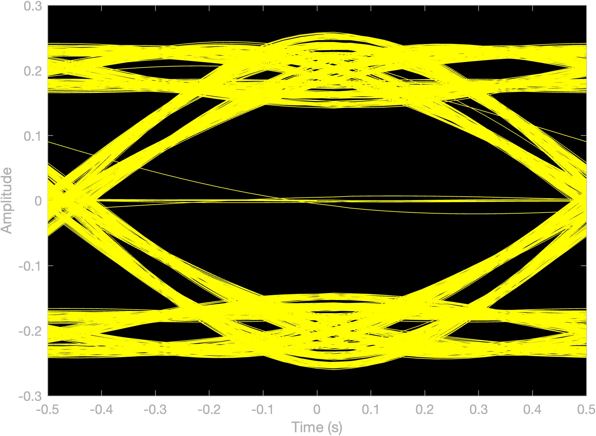

The Square Root Raised Cosine (SRRC) eye diagram appears somewhat closed at the transmitter output because an individual SRRC pulse has trailing noise that leaks beyond the bit duration. This does not satisfy Nyquist’s First Criterion for zero Inter-Symbol Interference (ISI). The SRRC’s tails do not cross zero at every integer multiple of the bit period ($T$), causing the energy from adjacent bits to leak into the current sampling instant. 

#### Q5: Frequency and Impulse Response of the Channel

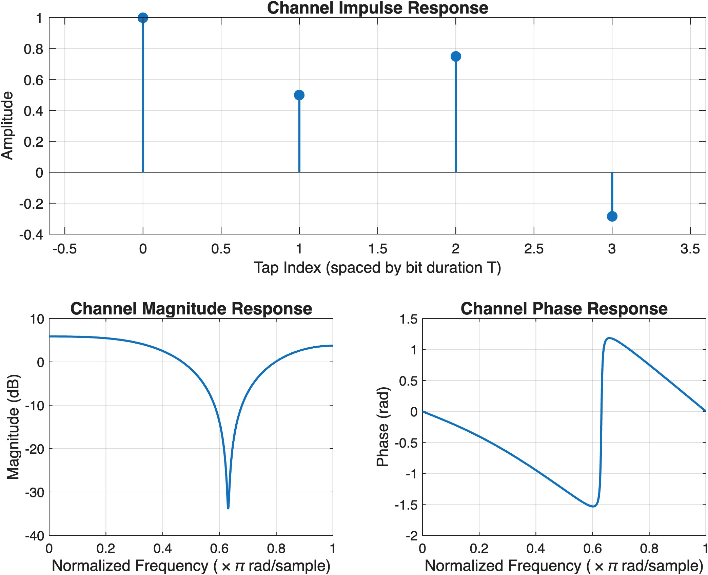

#### Q6: Eye Diagram of Channel Output

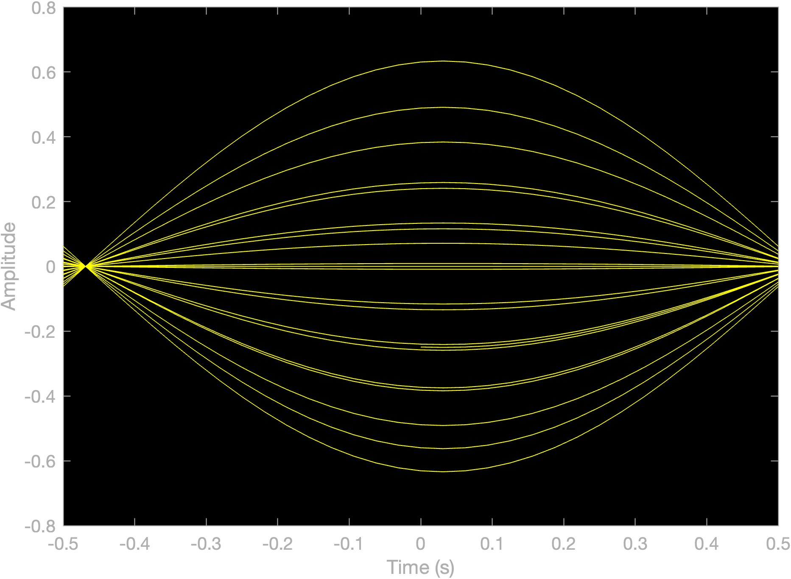

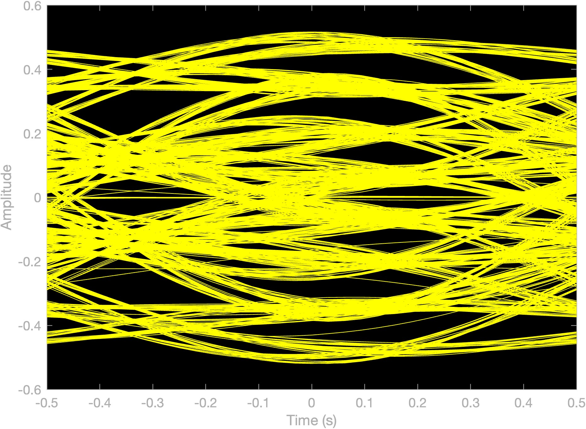

The eye diagrams at the channel output exhibit significant closure compared to the original transmitted signals, a direct result of Inter-Symbol Interference (ISI) introduced by the channel’s impulse response. Because the channel acts as a non-ideal filter, it causes the energy of each individual pulse to spread into adjacent bit periods, destroying the zero-crossing properties of the original Half-Sine and SRRC shapes.

#### Q7: Noisy Eye Diagram of Channel Output

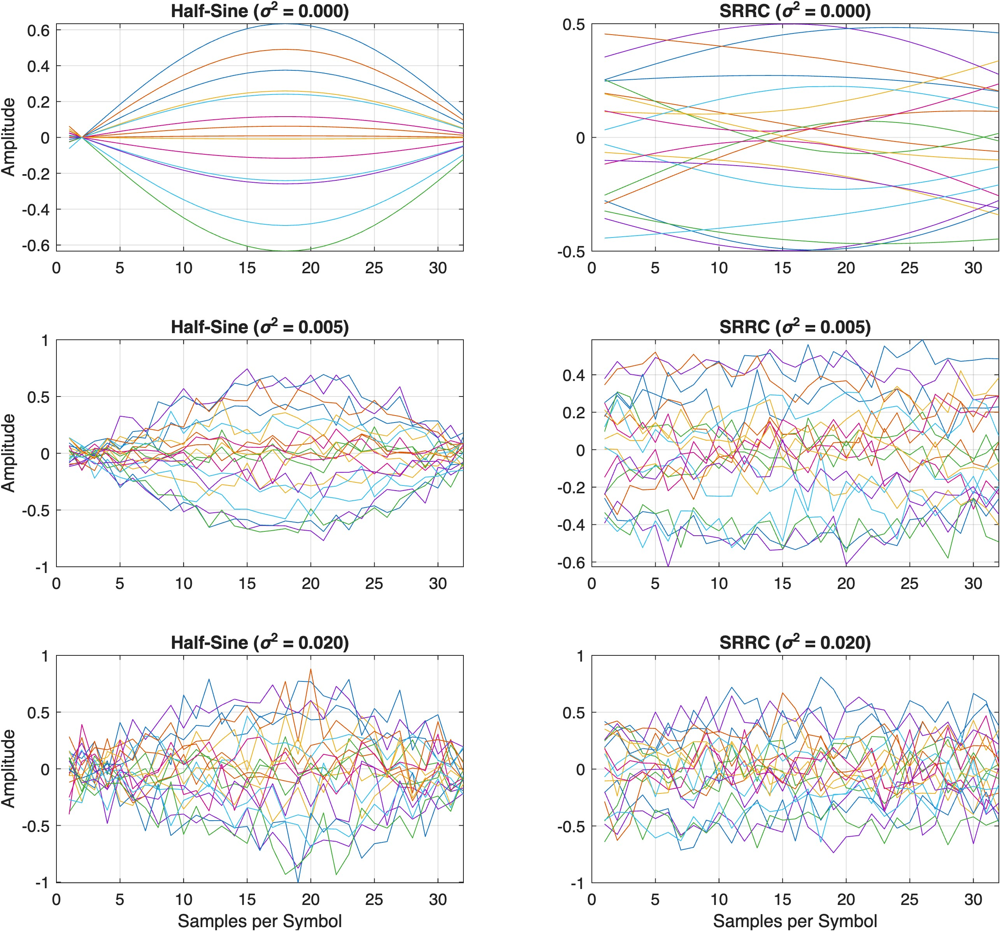

The addition of Gaussian noise introduces random vertical displacement to the signal, directly attacking the noise margin of the eye diagram. At lower noise powers ($\sigma^2$), the eye remains identifiable but fuzzy, indicating a functional but worsening communication link. However, as $\sigma$ increases, the random fluctuations eventually overwhelm the signal's structural transitions (ISI), causing the eye to close completely. In the high-noise scenarios, the diagrams become indistinguishable from one another, as the signal is ruined by the noise introduced from the Gaussian distribution. This visualization demonstrates the threshold at which a receiver would fail to differentiate between a '1' and a '0', leading to a significant spike in the bit error rate. 