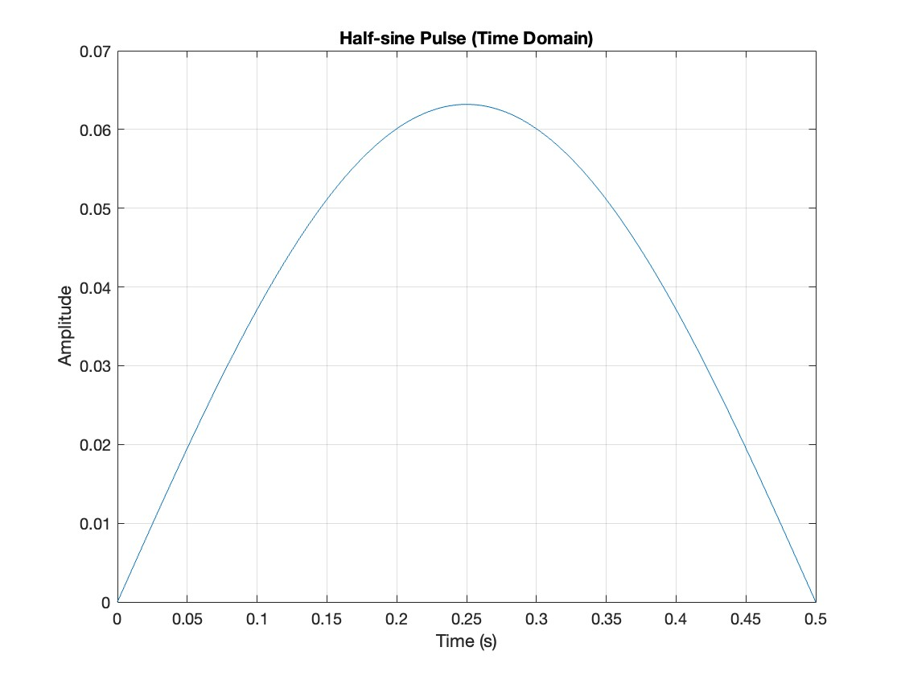
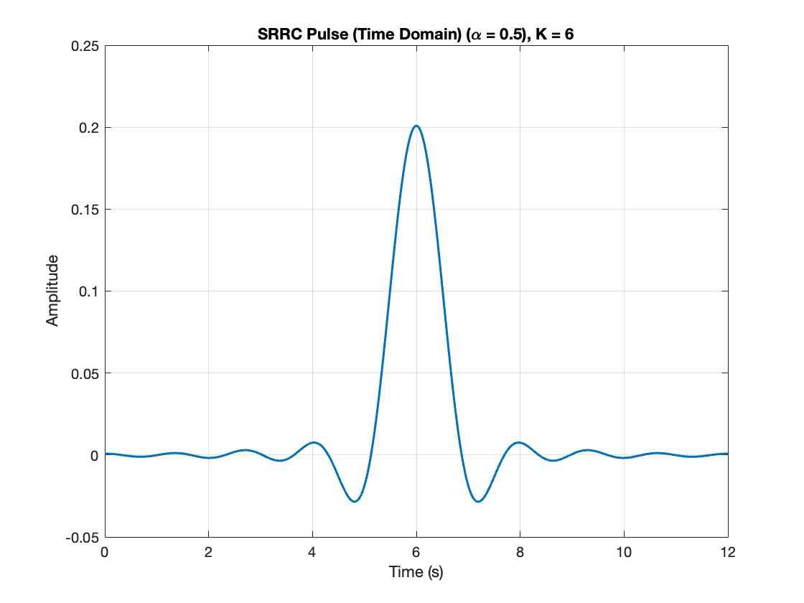
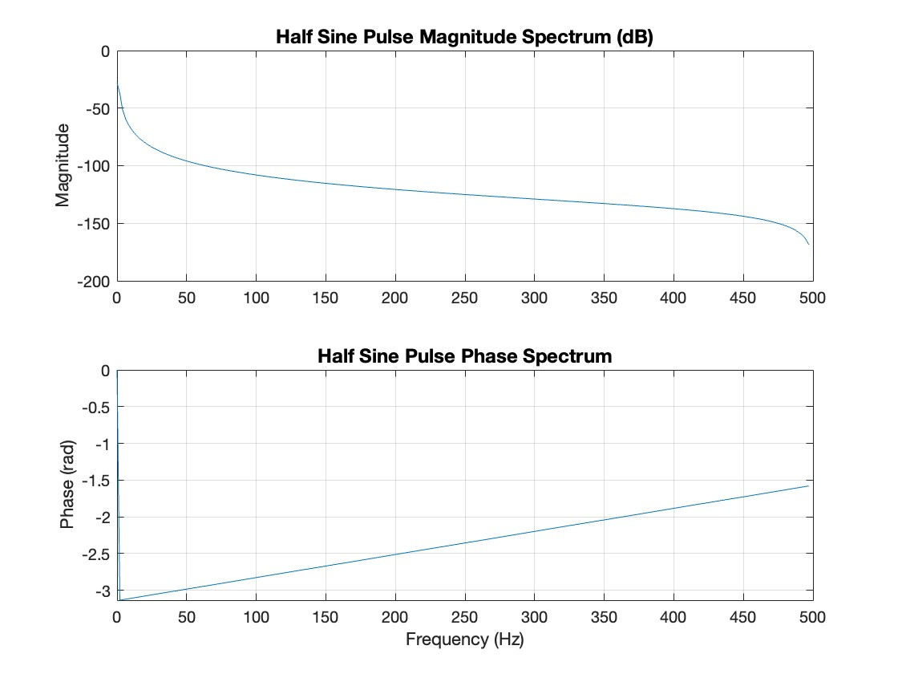
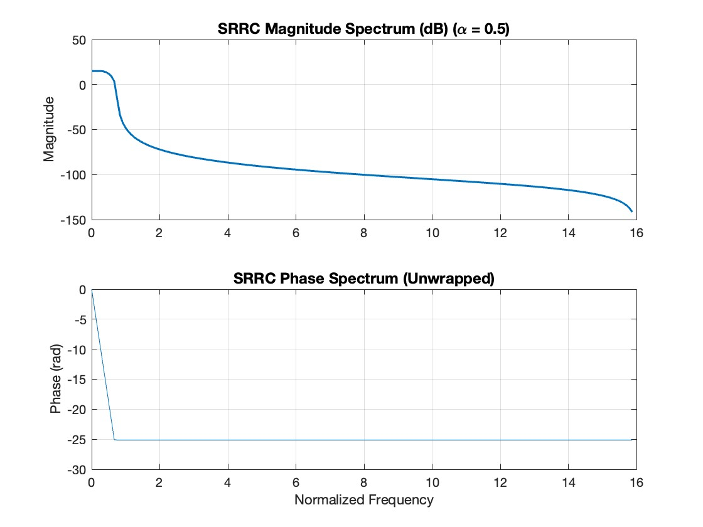

# EE107 Midterm Report

## Authors: Jacob Gerson, Asher Milberg, Mason Doshi

### Introduction
The EE107 final project tasks students with ....

 

### Phase 1: Image Preprocessing

Preprocessing requires the following steps:

1. Converting image to desired data type in Matlab (double)
2. Taking DCT (Discrete Cosine Transform) to get frequency composition of the image 
3. Quantizing our frequency coefficient values into discrete 8x8 DCT blocks to be transmitted

Our group landed on the following 1280 x 720 image to process :

### Phase 2: Conversion to Bit. Streeam

### Phase 3: Modulation (Questions 1-4)

1)  Below are the time domain plots for both the Half-sine pulse and SRRC (Square Root Raised Cosine):

And the frequency domain dB plots:

The SRRC bandwidth is much larger (15.61 Hz compared to 0.63Hz). The half-sine wave is a perfect delta function while the SSRC has some sidebands which explains why the bandwidfth is significantly larger than the half-sine bandidth.

Not sure about the side bands comment - 
