

# EE107 Final Report

## Authors: Jacob Gerson, Asher Milberg, Mason Doshi

---

### Introduction

Our group wanted to use this image for our project.

#### Q1: Pulse with more bandwidth

Here are the time-domain plots

**Half Sine Wave:**

**SRRC Wave:** 

And the frequency domain dB plots:

The half-sine frequency response uses more bandwidth that the SRRC pulse. The SRRC response has a flat response until ~ 0.5 Hz (which is shown by our rolloff factor alpha), and then drops off. 

In contrast, the half sine response decays very slowly - even at 5 Hz there is only ~ 30 dB drop off whereas at 5 Hz our SRRC response has dropped off by more than 100 dB.

A longer pulse in time means theres a shorter spectrum in the frequency domain and so this makes sense. Since the half-sine is much shorter in time (only one bit period) then its bandwidth is much greater while the SRRC has a much longer pulse in the time domain so its frequency bandwidth is much less.

As alpha decreases, the number of ripples around the peak increase and the bandwidth decreases and as alpha increases, the number of ripples decrease and the bandwidth increases since the transition band cutoff increases. This is because for increasing alphas, there is a larger cutoff so there is more bandwidth required.

Increasing K does not change the bandwidth of the SRRC pulse, since bandwidth is determined by α and T. However, a larger K reduces truncation error by preserving more of the pulse's decaying tails. This results in a frequency response that is closer to the ideal SRRC spectrum. A small K much more greatly truncates the tails, causing energy leakage and ripples visible in the frequency domain.

**SRRC time and frequency domain plots with k = 3:**

**SRRC time and frequency domain plots with k = 6, alpha = 0.1:**

#### Q2: 10 Random Bits

With a random 10 bit stream, below are the time domain modulations using both the half-sine pulse and SRRC pulse:

**Half-Sine Observations:** In the top plot, the half-sine modulated signal appears as distinct, non-overlapping half-periods of a sine wave. Because the half-sine pulse is strictly defined to exist only between $0 \le t \le 1$ bit duration, each pulse begins exactly where the previous one ends. This time-limited nature ensures that, at the transmitter, there is zero overlap between adjacent symbols.

**SRRC Modulation Observation:** In the bottom plot, the SRRC modulated signal looks very different. It looks like a continuous, fluctuating waveform that looks pretty analog. Because a single SRRC pulse spans 12 bit durations ($2K$), the pulses for the 10 consecutive bits overlap and interfere with each other. The amplitude at any given moment is the sum of the main lobe of the current bit and the decaying sidelobes of several surrounding bits.

#### Q3: Spectral Analysis of Modulated Signals

Plot the spectrum of the modulated signal (at the output of the pulse shaping filter) and compare with the pulse spectrum for each pulse. Do the modulated signal spectrum and pulse spectrum have similar shapes? Can you explain the reason for any difference?

Produced below are the spectra of both the modulated signals:

##### Overall Similarities

The modulated signal spectra (for both Half-Sine and SRRC) exhibit the same overall envelope as their corresponding isolated pulses from Question 1. This is because the spectral characteristics of a modulated signal are fundamentally determined by the pulse-shaping filter used. Mathematically, the modulated signal is a convolution of the pulse shape with a random bit sequence; in the frequency domain, this becomes a multiplication of the pulse's spectrum by the spectrum of the bit sequence.

##### Half-Sine Pulse Characteristics

The half-sine modulated spectrum is characterized by a prominent main lobe and a relatively gradual decay in the frequency domain. It features a rounded peak centered at $0$ Hz, which contains the vast majority of the signal's total energy. Because the half-sine pulse has sharp transitions in the time domain where the signal meets the zero-axis, its Fourier transform results in sidebands that decay at a relatively slow rate of $1/f^2$. This lack of a strict cutoff point results in significant high-frequency leakage, where the spectrum exhibits a continuous, slowly diminishing magnitude as frequency increases. This behavior makes the half-sine pulse less efficient for bandwidth-constrained systems, as it can lead to increased interference in adjacent frequency channels.

##### Square Root Raised Cosine (SRRC) Characteristics

The SRRC modulated spectrum is designed for high spectral efficiency and follows strict boundaries defined by its roll-off factor, $\alpha = 0.5$. Unlike the rounded peak of the half-sine, the SRRC exhibits a remarkably flat magnitude response near $0$ Hz, which ensures a more uniform distribution of power across the intended passband. The most defining feature of the SRRC is its extremely sharp cutoff; the magnitude transitions rapidly to a stopband of approximately $-80$ dB near the Nyquist frequency. This makes the SRRC spectrum significantly more "compact" and efficient than the half-sine. By $0.75$ Hz in a normalized system, the energy is almost entirely attenuated, making it an ideal choice for modern communication systems where frequency conservation is a priority.

##### Fluctuations

While the isolated pulses in the previous section produced perfectly smooth spectral curves, the modulated spectra appear jagged and erratic. This difference is caused by the random 10-bit data sequence. The specific arrangement of $+1$ and $-1$ bits creates a unique, high-variance frequency component. When this erratic component is multiplied by the smooth, theoretical frequency response of the pulse shape, it introduces constructive and destructive interference at specific frequencies across the band. Eye Diagrams

#### Q4: Modulated Signal Eye Diagrams

Plots and Comments for the Eye Diagrams for both the Half-Sine and SRRC.

The transmit Half-Sine eye diagram is almost perfectly overlayed on top of each other. It is shifted slightly to the right, but this makes sense as we took one slice of data off the end so the plots were lined up with each other. This eye is wide, which follows the characteristics of the half-sine modulation. In the half-sine the signal period for each bit is entirely seperated and there is no overflow onto the following period from the current bit being transmitted. Since there is little overflow this creates a wide open, and thin signaled, eye. 

The Square Root Raised Cosine (SRRC) eye diagram appears somewhat closed at the transmitter output because an individual SRRC pulse has trailing noise that leaks beyond the bit duration. This does not satisfy Nyquist’s First Criterion for zero Inter-Symbol Interference (ISI). The SRRC’s tails do not cross zero at every integer multiple of the bit period ($T$), causing the energy from adjacent bits to leak into the current sampling instant. 

#### Q5: Frequency and Impulse Response of the Channel

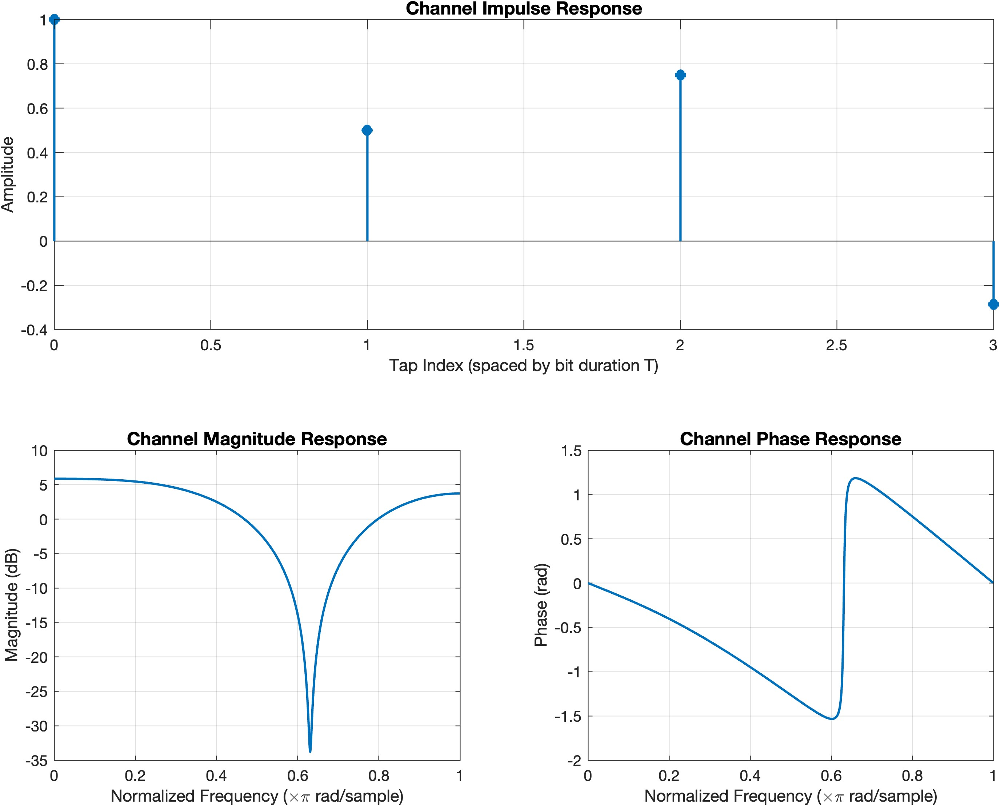

#### Q6: Eye Diagram of Channel Output

The eye diagrams at the channel output exhibit significant closure compared to the original transmitted signals, a direct result of Inter-Symbol Interference (ISI) introduced by the channel’s impulse response. Because the channel acts as a non-ideal filter, it causes the energy of each individual pulse to spread into adjacent bit periods, destroying the zero-crossing properties of the original Half-Sine and SRRC shapes.

#### Q7: Noisy Eye Diagram of Channel Output

The addition of Gaussian noise introduces random vertical displacement to the signal, directly attacking the noise margin of the eye diagram. At lower noise powers ($\sigma^2$), the eye remains identifiable but fuzzy, indicating a functional but worsening communication link. However, as $\sigma$ increases, the random fluctuations eventually overwhelm the signal's structural transitions (ISI), causing the eye to close completely. In the high-noise scenarios, the diagrams become indistinguishable from one another, as the signal is ruined by the noise introduced from the Gaussian distribution. This visualization demonstrates the threshold at which a receiver would fail to differentiate between a '1' and a '0', leading to a significant spike in the bit error rate.

#### Q8: Matched Filter Output - Impulse and Frequency Response Graphs

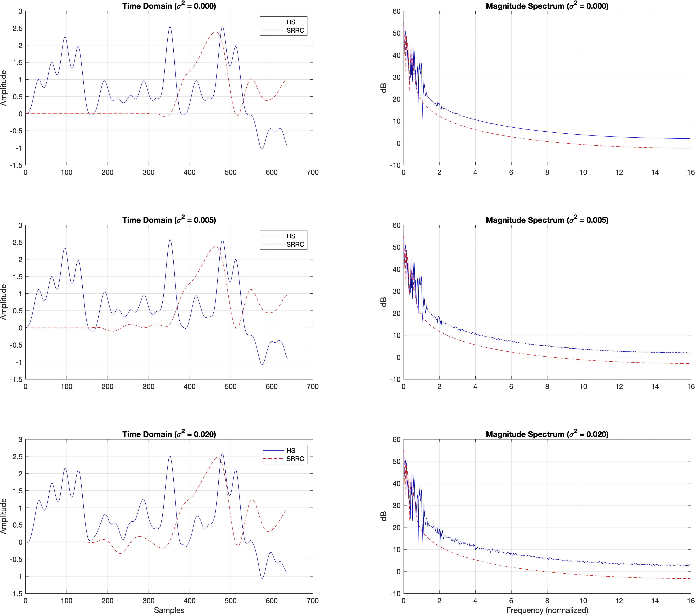

The impulse and frequency reeponses in Q1 represent the ideal pulse shapes and their spectrums. 

The below Q8 plots correspond to the matched filter output. Comparing against the ideal signal plots from Q1, it's clear that the signals are noisy and barely resemble the original pulses. The frequency response graphs are also noisy and have some fluctuations due to the channel ISI and additive random noise. However, the spectral shape is still a lowpass and the SRRC signal is still bandlimited than the half since, so we maintain that the right data is being sent through, albeit with many pertubations. 

#### Q9: Matched Filter Output - Eye Diagrams for 1 & 2 Bit Durations

**Matched Filter Eye Diagram - 1 Bit Duration**
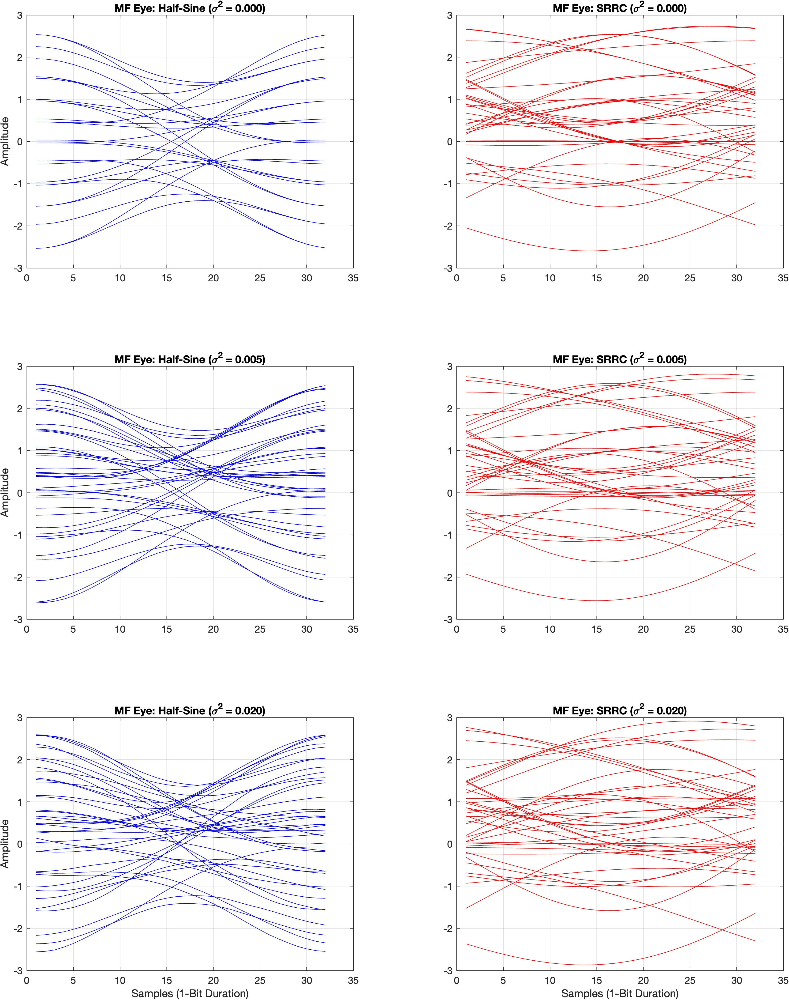

**Matched Filter Eye Diagram - 2 Bit Duration**
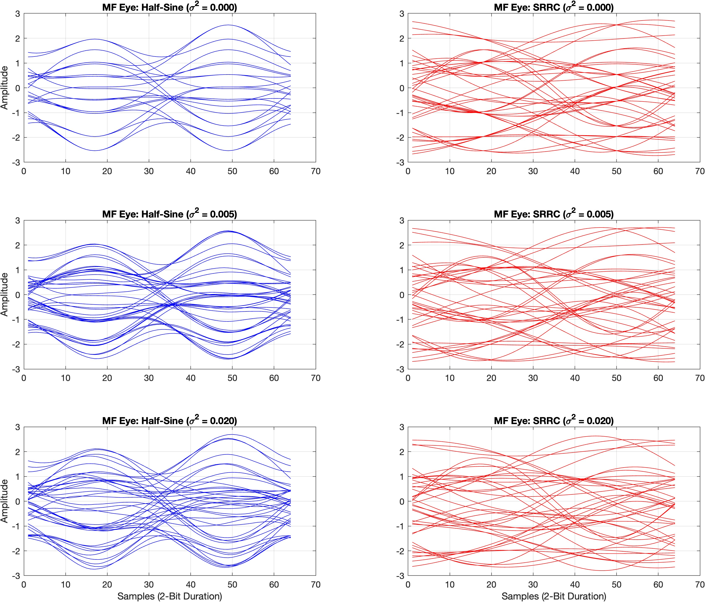

For the half sine, we want to sample at 0.5 seconds. (Max Eye Opening).
For the SRRC we want to sample at 0.3 seconds. (Max Eye Opening)

#### Q10: The Zero-Forcing (ZF) Equalizer

We will implement the zero-forcing filter by computing the frequency response of the channel and then create an inverse filter by taking the reciprocal of the channel response in the frequency domain. Then it will be converted back to the time domain to get the impulse response of the ZF equalizer. The signal is convolved with the equalizer which will ideally cancel out channel distortion.

Here are both the impulse and frequency responses of the zero-forcing filter:

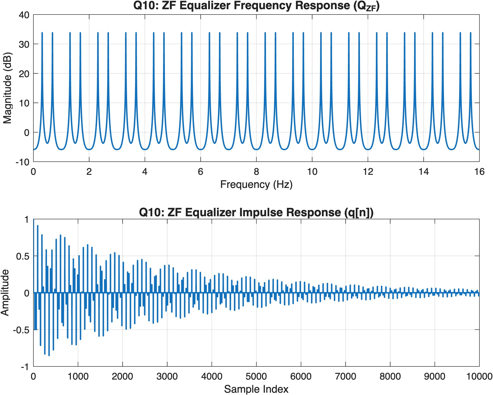

The frequency response of the zero forcing equalizer has large spikes at frequencies where the channel amplifies the signal. The impulse response is very long and decays very slowly. The ZF equalizer is stable because H(f) is never 0, so 1/H(f) is finite at all frequencies. 

The channel's inverse is not always guaranteed to be stable - at certain discrete samples the channel response is 0 and results in an infinite response from the Zero-Forcing channel. 

#### Q11: Zero-Forcing (ZF) Equalizer Eye Diagrams

The following unified figure shows the eye diagrams for both Half-Sine (HS) and SRRC pulse shapes after Zero-Forcing equalization across different noise levels ($\sigma^2 = 0, 0.005, 0.02$):

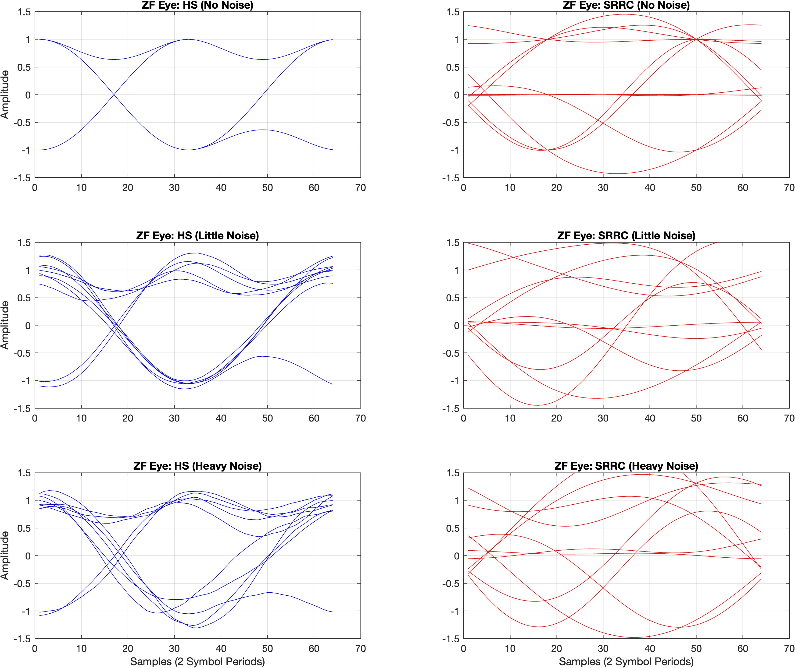

These graphs show exactly what is expected of the zero forcing (ZF) equalizer. With little noise we can see the effects clearly for both pulse shapes, where the magnitudes stay between -1 and 1. However, once noise is added the magnitudes shoot way beyond these values as the equalizer cannot account for these variables.

**Zero-Forcing Time Domain Output (10-bit stream):**

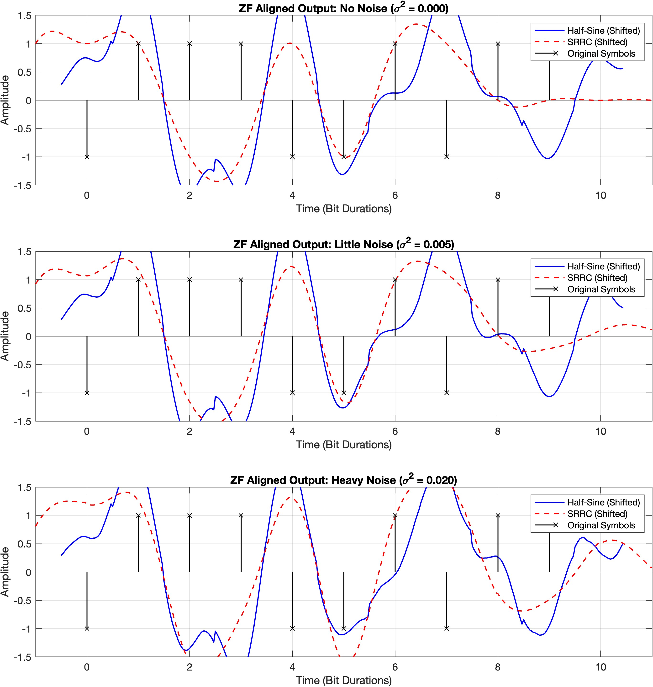

These results are an updated graph to show the progess of our information along this communication system's path. 

#### Q12 The MMSE Equalizer 

To compute the MMSE filter, we did most of the math in the frequency domain. By utilizing the FFT and the frequency math to get the equation for the MMSE. Then, by taking the ifft of this frequency response to get the impulse response of the filter. Finally by convolving this with the output of the channel to get the final output of the filter.

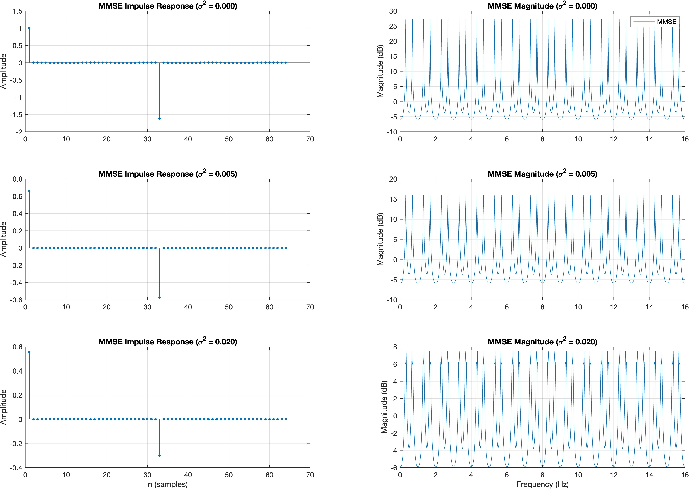

The Zero-Forcing (ZF) equalizer tries to perfectly invert the channel, but this backfires by creating "ringing" and long messy tails in the impulse response. Because it ignores noise, it amplifies interference at frequencies where the channel is weak, leading to a cluttered output.

The MMSE equalizer is much cleaner because it balances fixing the channel with suppressing noise. Its impulse response shows only the essential spikes—one to capture the main signal and another to cancel the primary echo—without the extra "junk." This makes the MMSE eye diagrams stay significantly more open and stable as the noise increases compared to the ZF results.

#### Q13: The MMSE Equalizer Eye Diagrams

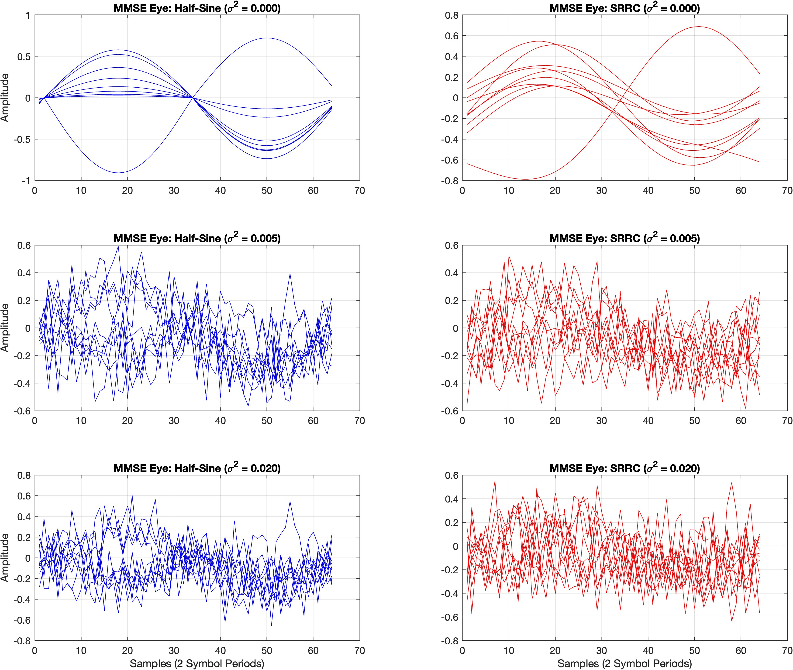

These graphs give an expected output for the filter. The outputs are normalized and with an increase in noise, the output of the filter does perform better in producing a reconizable eye diagram as compared to the zero forcing equalizer. However, there is still significant noise.

**MMSE Time Domain Output (10-bit stream):**

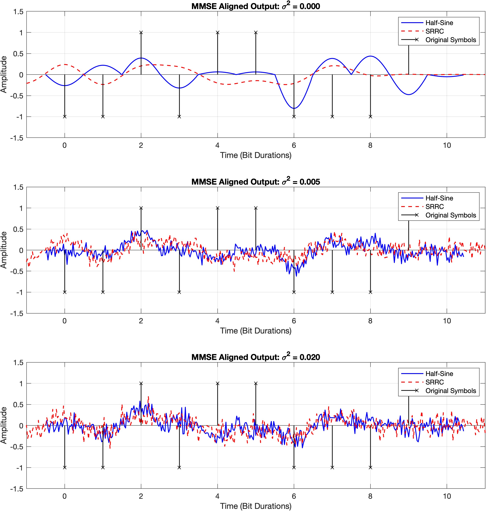

While significant noise still compromises the results to where it is incredibly hard to see. The MMSE does a better job at clearing up the noise.

#### Q14: Final Image Transmission Comparison

Below is the **grayscale reference image** that is actually processed and transmitted through the system (after 8x8 DCT block processing and bit conversion):

To comprehensively evaluate our system, we simulated the transmission of the full image across all combinations of pulse shaping (Half-Sine vs. SRRC), equalization (Zero-Forcing vs. MMSE), and noise levels ($\sigma^2 \in \{0.00, 0.005, 0.02, 0.05\}$).

The result grid below showcases how each component contributes to the final image quality:

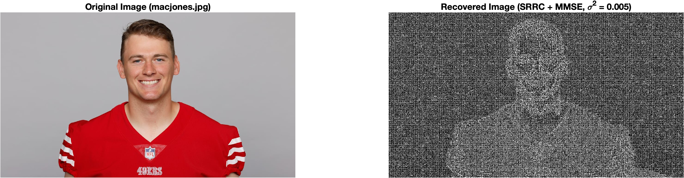

##### Key Observations:

Overall, MMSE equalizer has a clearer and much better performance as the noise level increases throughout the trials. With lower noise there is little difference (if any the MMSE is worse), however the special effects of the MMSE is shown when the noise levels are increased and there are less bit errors. For difference in pulses there seems to be little if any difference in the behavoir between the pulse shapes. The outcome of each image is almost entirely the same.

#### Q15: Critical SNR Thresholds

Half Sine: The critical SNR threshold is the point where the Bit Error Rate (BER) becomes high enough to visibly degrade the reconstructed image is when the noise variance = 0.005 . Since we have normalized the power of the signal to be 1, the SNR = Psig/Pnoise = 1/0.005. In dB this equates to 23dB.

SRRC: The critical SNR threshold is the point where the Bit Error Rate (BER) becomes high enough to visibly degrade the reconstructed image is when the noise variance = 0.05 . Since we have normalized the power of the signal to be 1, the SNR = Psig/Pnoise = 1/0.05. In dB this equates to 13dB.

Here is the BER vs SNR graph for the ZF and MMSE equalizers:

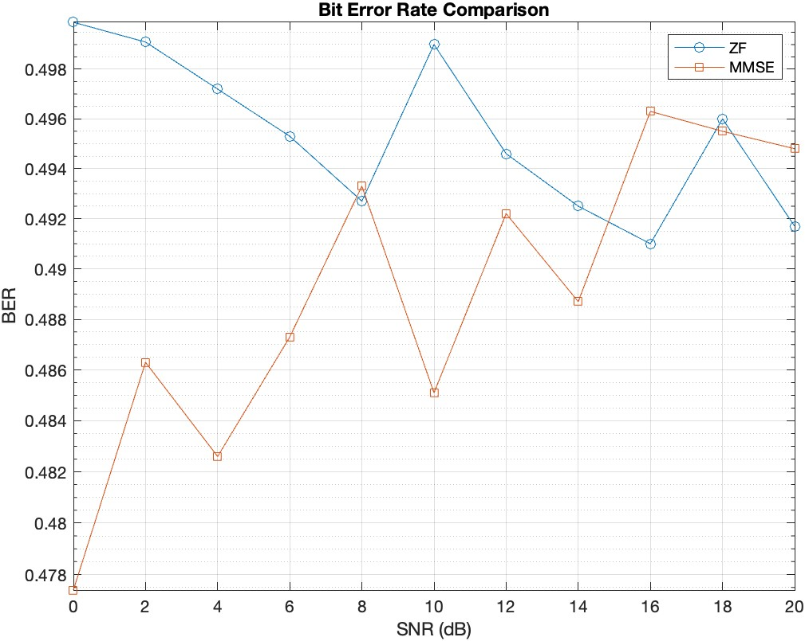

#### Q16: Performance on Different Images

Below are the results for doing the same analysis and modulation on a picture of Raven's QB Lamar Jackson:

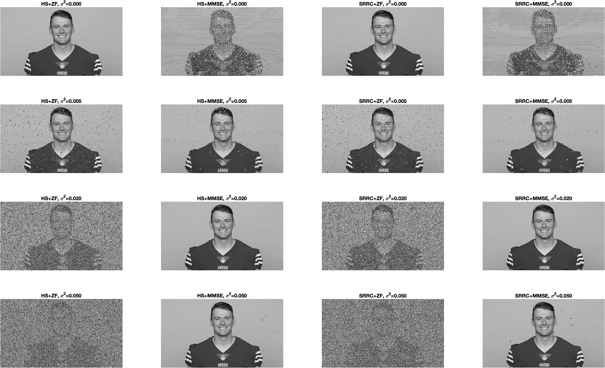

From the image above we can clearly see that the effects on the new image is almost identical as to the original image of Mac Jones. The difference between the two pulses and the two different equalizers are the same variance as it was in the first test of Mac. We can see that as the noise increased the MMSE equalizer has a vastly better effect on handling the noise and having a much clearer output. As for the pulse shape, the results (just like the original image) are almost identical to each other. It seems that pulse shape has no difference when simulated from our simulation results.

#### Q17: Nyquist Criterion and Zero ISI

PLOT THE OUTPUT OF THE MATCHED FILTER FOR BOTH PULSES FIRST:

Again, from Q9, here is the eye diagram of both pulses across noise environments: 

**Matched Filter Output Eye Diagram**

For either output to satisfy the Nyquist criterion, the output eye diagrams would need to exhibit complete convergence at our determined sampling times for both pulses. In neither case is the Nyquist criterion for zero ISI at those sampling times met.

However, the combination of the half-sine pulse output of the matched filter and the MMSE equalizer produces an output that does satisfy the Nyquist criterion. Those diagrams, originally shown in Q13, show the elimination of ISI at the ideal sampling point of the random bit stream.

Ideally, the output of the image data reflects the half-pulse used in conjuction with the MMSE equalizer being the best option for transmission when no noise is present in the system. However, it's likely that this advantageous quality is drowned out by the properties demonstrated by the SRRC pulse at higher noise levels. 

#### Q18: Error Performance at Equal Energy

We expected that the error performance is roughly the same between the two pulses. Since both pulses have the same energy, they should have the same SNR at the receiver for the same noise power. However, we would still expect differences in ISI and filtering between the two. The SRRC pulse is designed so that, after matched filtering, the response behaves like a raised cosine pulse, which reduces ISI at the sampling points. The half-sine pulse is not designed to satisfy the Nyquist zero-ISI condition after the matched filter, so we would expect the SRRC to have better error performance.

We used the images that were produced for Q14. At a σ^2 of 0.005 (with all other variables kept constant) and looking at the MMSE equlizer results, we can see that the SRRC pulse does much better. The images are very similar but there is just slightly less noise in the SRRC output. Even though both pulses have the same energy, the SRRC is more robust to noise.

#### Q19: Bandwidth and Pulse Length

From the frequency response plots in question 1 and the modulated signal spectra in question 3, we can see that the half sine pulse has a higher bandiwth with many sidelobes being far beyond the main lobe. The SRRC pulse, however, has its sidelobes closer to the main lobe and has a smaller bandwidth. The half sine pulse only happens for one period so since its short in the time domain, its extends a lot in the frequency domain. The SRRC is wider in time and more compact in the frequency domain due to it spanning more time intervals of each transmitted symbol. The SRRC is more bandwidth efficient because of the smaller bandiwdth and because it reduces the components that are out of the frequency range we are looking at. This is good since the bandwidth is limited in our case. But, the longer duration of the SRRC causes more symbol overlap which could lead to  higher ISI.

#### Q20: Conclusion on Pulse Shaping
Overall, as expected, given what we learned in class, the SRRC outperforms the half sine pulse in image reconstruction, although it's pretty close. The SRRC + MMSE gave the best results. The main drawbacks of the SRRC (as discussed in question 19) is that it is longer in time. The SRRC pulse spans across many bit durations so it causes more pulse overlap at the transmitter and makes sampling more sensitive. It is also nore complex to implement than the half-sine. But, the SRRC gives better bandwidth control and is more robust to noise (emphasesized by our results). 

#### Q21: Performance Under New Channels
The communication system did not work seamlessly when we plugged in the new channels. The image is barely recognizable for both channels but some information is still there. There is a lot of noise in both images and visible reconstruction errors.

The indoor channel performed slightly better than the outdoor channel. In the indoor channel output, the face and body outlines are more defined and you can tell that the shirt the person is wearing is a jersey. This makes snese since the outdorr channel has logner delayed echoes which causes more ISI and makes equalization harder. 

The power gain of a channel is the energy of its impulse response:

$$
\|h\|^2 = \sum_{n} |h[n]|^2
$$

### Outdoor Channel

$$
\|h_1\|^2 = 0.5^2 + 1^2 + 0.63^2 + 0.25^2 + 0.16^2 + 0.1^2
$$

$$
= 0.25 + 1 + 0.3969 + 0.0625 + 0.0256 + 0.01
$$

$$
= 1.745
$$

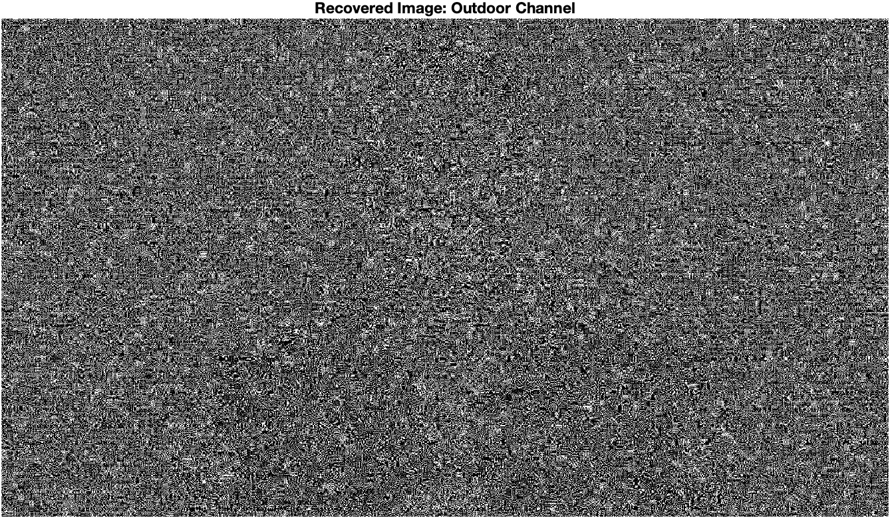

### Indoor Channel

$$
\|h_2\|^2 = 1^2 + 0.4365^2 + 0.1905^2 + 0.0832^2 + 0.0158^2 + 0.003^2
$$

$$
= 1 + 0.19053225 + 0.03629025 + 0.00692224 + 0.00024964 + 0.000009
$$

$$
\approx 1.234
$$

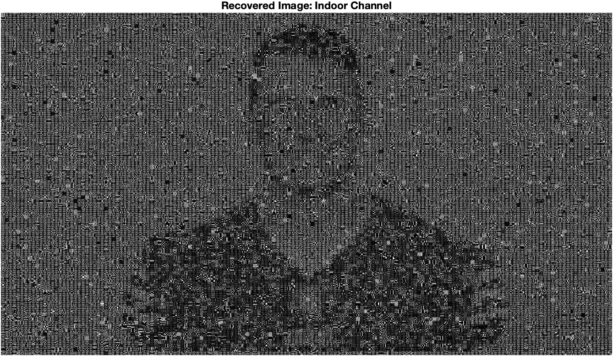

The outdoor channel has a higher power gain. However, the autdoor channel has worse image quality because its energy is spread across longer delays which creates more ISI, while the indoor channel's energy is concetrated around the concise delays so the recovered image is better.

